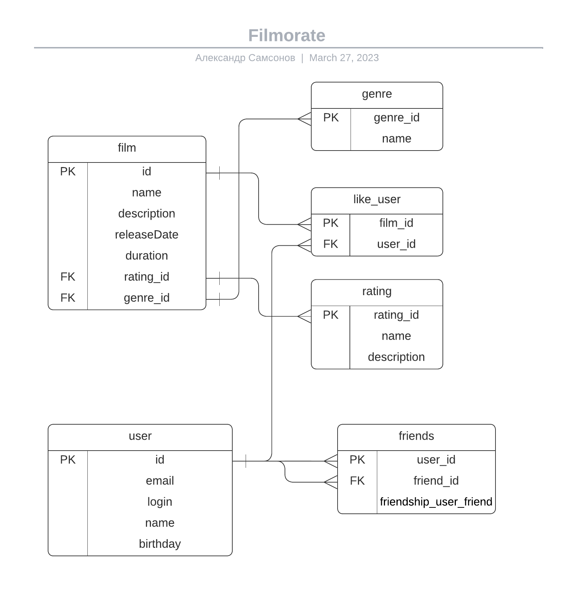

# java-filmorate
Учебный проект Яндекс.Практикум.


Блок-схема Базы Данных приложения:



<details>
<summary>Примеры запросов</summary>
Список всех фильмов:

```roomsql
SELECT f.id,
    f.name,
    f.description,
    f.releaseDate,
    g.name,
    r.name
FROM film AS f
LEFT JOIN genre AS g ON f.genre_id=g.genre_id
LEFT JOIN rating AS r ON f.rating_id=r.rating_id
ORDER BY f.id ASC;
```

Список всех пользователей:

```roomsql
SELECT *
FROM user
ORDER BY id ASC;
```

Список всех фильмов в жанре {Название жанра}:

```roomsql
SELECT f.*
FROM film AS f
LEFT JOIN genre AS g ON f.genre_id=g.genre_id
WHERE g.name = '{Жанр}'
ORDER BY f.id ASC;
```

Топ 10 фильмов по количеству лайков:

```roomsql
SELECT f.name,
    COUNT(l.user_id) AS count_like
FROM film AS f
LEFT JOIN like_user AS l ON f.id=l.film_id
ORDER BY count_like DESC
LIMIT 10;
```

</details>


