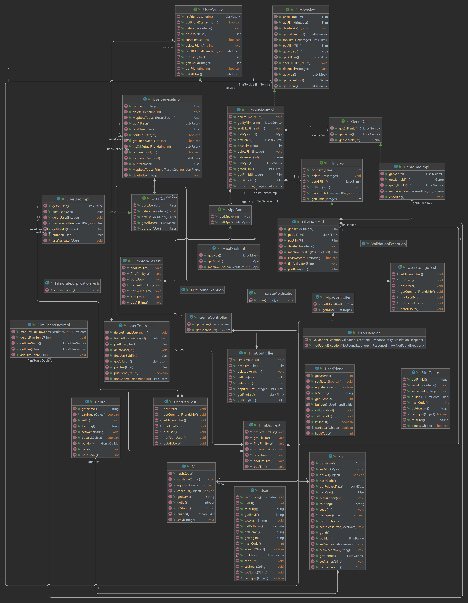

# java-filmorate
Учебный проект Яндекс.Практикум.

## Описание
       

Filmorate - это бэкэнд-сервис на основе Restful API для хранения и управления информацией о фильмах(название, рейтинг MPA, жанр, описание и продолжительность), составления рейтинга фильмов на основе отзывов пользователей, поиска фильма, а также для общения пользователей.
## Блок-схема Базы Данных приложения:


<details>
<summary>Примеры запросов</summary>
Список всех фильмов:

```roomsql
SELECT * FROM films
ORDER BY film_id ASC;
```

Список всех пользователей:

```roomsql
SELECT *
FROM user
ORDER BY user_id ASC;
```

Список всех фильмов в жанре {Название жанра}:

```roomsql
SELECT f.*
FROM film AS f
LEFT JOIN film_genres AS fg ON f.film_id=fg.film_id
LEFT JOIN genre AS g ON g.genre_id=fg.genre_id
WHERE g.genre_name = '{Жанр}'
ORDER BY f.film_id ASC;
```

Топ 10 фильмов по количеству лайков:

```roomsql
SELECT * FROM films AS f 
LEFT JOIN mpa AS m ON f.mpa_id = m.mpa_id 
LEFT JOIN film_likes AS l ON f.film_id = l.film_id 
GROUP BY f.film_id 
ORDER BY SUM(l.film_id) DESC, f.name 
LIMIT(?)
```

</details>

## Диаграмма классов



